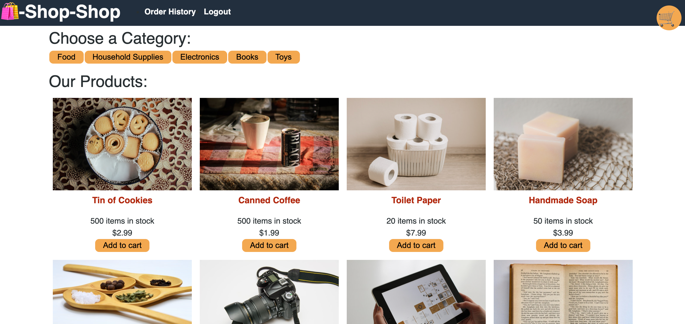
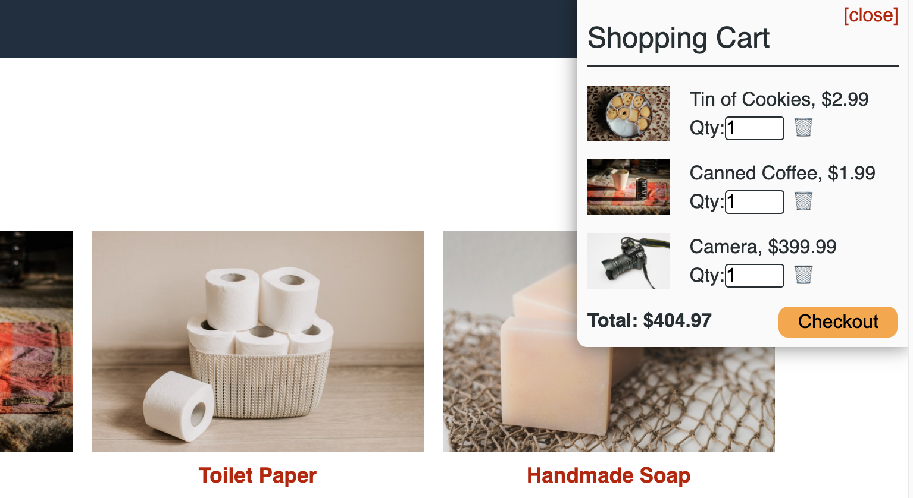
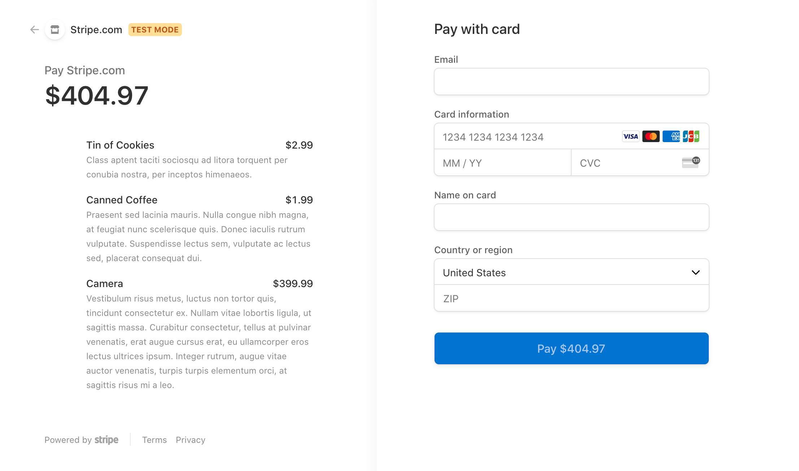

  # E-Commerce Shop
  

  
  ## Description: 

  The Shop-Shop app is an e-commerce app that utilizes React, React Context for global state management, IndexedDB for persistent storage, MongoDB, Mongoose, Apollo, the Stripe library for processing payments, and CSS. The app functions as a PWA, allowing the user to continue browsing the products and adding/deleting products from their cart. The items are persistent upon page reload, as well. 

  # Deployed Site:
  https://dry-sierra-85935.herokuapp.com/

  
  ---
  
  ---
  
  

   

  ## Table of Contents:
  * [Installation](#installation)
  * [Usage](#usage)
  * [Contributing](#contributing)
  * [Tests](#tests)
  * [Questions?](#questions)
  
  ## Installation: 
 
  The user can clone the repo and npm `npm i` within the root directory, server, and client directories to install the packages necessary the application. Upon initially seeding data when deploying or re-deploying app to Heroku, change heroku-postbuild in package.json in root directory to: `"heroku-postbuild": "concurrently \"cd client && npm run build\" \"cd server && npm run seed\""`
  

  
  ## Usage: 

  The user can create an account and sign in to browse products. The products that a user may leave in their cart will persist via session storage. Once the user is ready to check out, the can process their payment info via the Stripe payment interface. 
  

  
  ## Contributing: 

  If you would like to contribute, create a pull request.
  

  
  ## Tests: 
  There are tests located in the client folder which can be ran using `npm run test` to verify proper functionality. 
  
  

  
  ## Questions?:
  * <a href="https://github.com/gwarzecha" target="_blank">GitHub</a>
  * <a href="mailto: gmwarzecha@gmail.com" target="_blank">Email</a>
  
  ## License: 

  This project is covered under the MIT license.